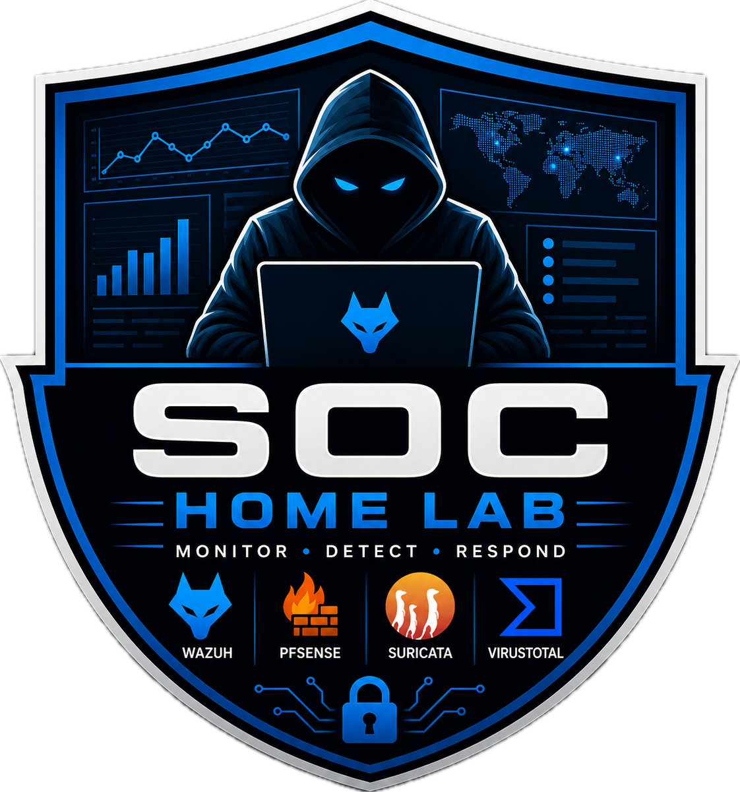

<div align="center">
  

  # Wazuh SOC Home Lab

  **Monitor • Detect • Respond**

  
  
  
  
  
</div>

---

## Overview

This repository documents the development of a personal **Security Operations Center (SOC) Home Lab** built entirely with open-source security tools. The project simulates real-world attack and defense scenarios by combining endpoint monitoring, firewall logging, network intrusion detection, threat intelligence, and security event management into a centralized SIEM platform.

The primary goal is to gain hands-on experience with SOC operations — including threat detection, log analysis, and incident investigation — while building practical, job-ready cybersecurity skills.

---

## Architecture

<div align="center">

| Component | Role |
|---|---|
| **Ubuntu Server** | Wazuh Manager · Indexer · Dashboard |
| **Windows 11** | Wazuh Agent · FIM · PowerShell & Event Log Collection |
| **Kali Linux** | Attack Simulation · SSH Brute Force · Security Testing |
| **pfSense Firewall** | Network Segmentation · Firewall Logging · Traffic Monitoring |
| **Suricata IDS** | Network Intrusion Detection · JSON Event Logging · Wazuh Integration |
| **VirusTotal** | Threat Intelligence · File Reputation · Malware Hash Lookup |

</div>

> 📐 See [`docs/Lab_architecture.png`](Lab_architecture.png) for the full lab topology diagram.

---

## Project Documentation

Each report below focuses on a specific component of the SOC lab.

### 1. 🛠️ Wazuh Installation & Configuration
Covers deploying the **Wazuh Manager, Indexer, and Dashboard** on Ubuntu Server, connecting Windows endpoints, and verifying agent–manager communication.

→ [`docs/01-wazuh-installation.md`](docs/01-wazuh-installation.md)

---

### 2. 🪟 Windows Event Logging
Documents Windows Event Logs, common Event IDs, PowerShell logging, and how Windows events are collected and centralized in Wazuh.

Topics covered:
- Windows Event Viewer (Security, Application Logs)
- Key Event IDs for security monitoring
- PowerShell Script Block Logging
- Log forwarding to Wazuh

→ [`docs/02-windows-event-logging.md`](docs/02-windows-event-logging.md)

---

### 3. 📁 File Integrity Monitoring (FIM)
Demonstrates how Wazuh monitors files and directories in real time to detect unauthorized changes.

Activities performed:
- Monitoring custom folders
- Detecting file creation, modification, and deletion
- Viewing FIM alerts inside the Wazuh Dashboard

→ [`docs/03-file-integrity-monitoring.md`](docs/03-file-integrity-monitoring.md)

---

### 4. 🔐 SSH Brute Force Detection
Simulates an SSH brute force attack using **Hydra** against a Windows system running OpenSSH, and detects it with Wazuh.

Topics covered:
- Installing and configuring OpenSSH on Windows
- Password dictionary attacks with Hydra
- Windows Event ID **4625** (failed logon)
- Brute force detection rules in Wazuh

→ [`docs/04-ssh-brute-force-detection.md`](docs/04-ssh-brute-force-detection.md)

---

### 5. 🔥 pfSense Firewall Integration
Integrates pfSense firewall logs with Wazuh for network-level visibility and anomaly detection.

Topics covered:
- pfSense installation and network configuration
- Remote Syslog setup
- Firewall log collection in Wazuh
- Custom decoders and detection rules

→ [`docs/05-pfsense-integration.md`](docs/05-pfsense-integration.md)

---

### 6. 🦦 Suricata IDS Integration
Covers integrating the **Suricata IDS/IPS** with Wazuh for network intrusion detection.

Activities performed:
- Installing Suricata and configuring rule sets
- Enabling JSON event logging
- Monitoring network traffic
- Forwarding Suricata alerts to Wazuh

→ [`docs/06-suricata-integration.md`](docs/06-suricata-integration.md)

---

### 7. 🧬 VirusTotal Integration
Demonstrates enriching Wazuh security alerts with external threat intelligence via the **VirusTotal API**.

Features:
- VirusTotal API integration with Wazuh
- Automated file reputation and hash lookups
- Malware detection and threat enrichment within alerts

→ [`docs/07-virustotal-integration.md`](docs/07-virustotal-integration.md)

---

## Tools & Technologies

| Category | Tool |
|---|---|
| SIEM / XDR | Wazuh |
| Firewall | pfSense |
| IDS / IPS | Suricata |
| Threat Intelligence | VirusTotal |
| Attacker VM | Kali Linux |
| Endpoint | Windows 11 |
| Server | Ubuntu Server |
| Virtualization | UTM |
| Host OS | macOS |

---

## Skills Demonstrated

```
SIEM Deployment          Log Management            Threat Hunting
Security Monitoring      Windows Event Analysis    PowerShell Logging
File Integrity (FIM)     SSH & Brute Force Detect  Network Security
Firewall Configuration   IDS Integration           Threat Intelligence
Incident Investigation   Linux Administration      Windows Administration
```

---

## Learning Outcomes

Through this project, I gained practical experience in:

- Deploying and managing a production-style SIEM platform
- Collecting and analyzing endpoint and network logs
- Detecting brute force attacks and investigating failed authentications
- Monitoring file integrity across critical directories
- Integrating firewall and IDS logs for unified visibility
- Enriching alerts with external threat intelligence
- Building a realistic, multi-component SOC lab using only open-source tools


---

<div align="center">
  <sub>Built for learning · Powered by open-source · Monitor • Detect • Respond</sub>
</div>
